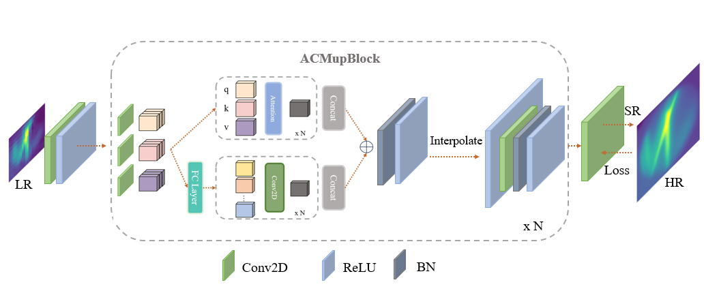

# PACmixSR (Progressive-ACmix Super Resolution)
This algorithm employs the [ACmix](https://github.com/LeapLabTHU/ACmix) organically fusing convolutional neural network and self-attention mechanism and progressively realizes
super-resolution.

  

</br>


## Install
```
pip install -r requirement.txt
```

</br>


## Infrared Dataset
We obtain paired high-resolution image and low-resolution images after contacting the sensor surface with objects of different shapes. We set the
temperature range to $0 ∼ 100^o C$ and collected total 800 pair of images, with each pair of data containing one
high-resolution image and one low-resolution image.

- trainsets: 640 for training
- testsets: 160 for testing


</br>

## Train

### Single-GPU
```
python main_train_psnr.py --opt options/train_pacmix_temperature_x8.json
```
### Multi-GPU
```
python -m torch.distributed.launch --nproc_per_node=4 --master_port=1234 main_train_psnr.py --dist True --opt options/train_pacmix_temperature_x8.json
```

</br>

## Test
```
python main_test_pacmixer_modify_x8.py
```
> The pretrained model is in `model_zoom`.


