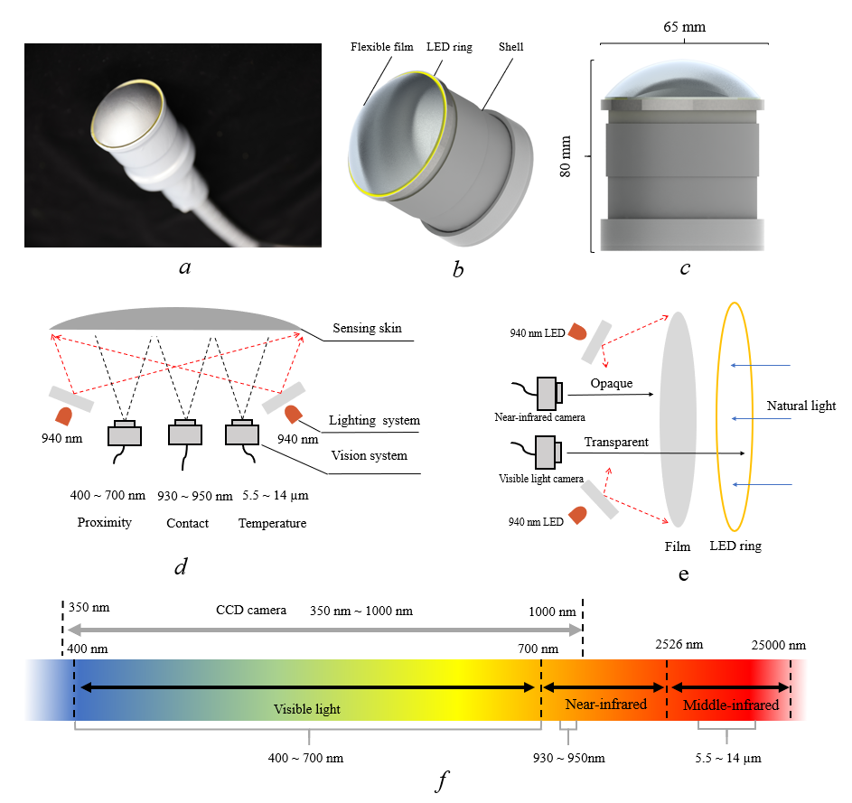

# A High-Resolution Multimodal Tactile Sensor Based on Multispectral Visuotactile Sensing

High-resolution multimodal tactile perception is one of the challenges in the field of robotics research. In this article, we propose a novel tactile sensor that enables the detection of optical information in the frequency bands from visible, near-infrared to mid-infrared and can simultaneously realize high-resolution sensing of temperature, texture, deformation, force, and proximity based on visuotactile sensing technology. To achieve those functions, we not only design a low-cost, small-size multi-spectral visual imaging system but also create an elastic film whose permeability is regulated by the brightness of the light. To realize pixel-level force sensing, we propose a 3D force sensing method combined with finite element analysis, which can achieve a 3D force information sensing accuracy of 0.05N.  Then, we also study the depth reconstruction algorithm for elastic surfaces, the super-resolution algorithm for temperature information, the viscosity classification algorithm, the proximity perception algorithm, and the multimodal information fusion algorithm. Finally, we conduct liquid classification experiments, fragile and ultralight object grasping experiments, circuit board failure detection experiments, underwater hot spot detection experiments, etc., which indicate the huge potential of our research across a wide range of applications.

  

 

